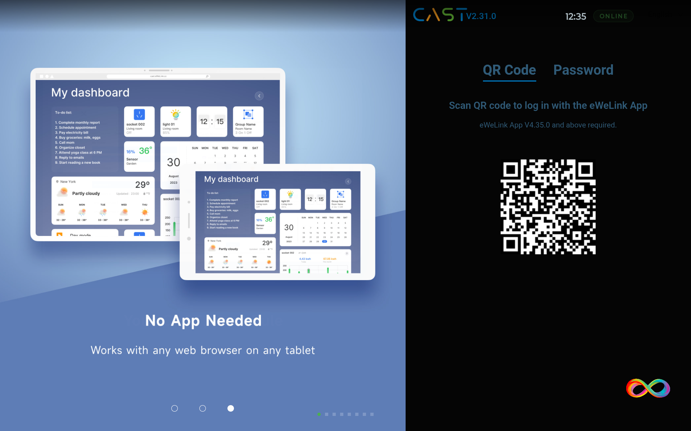
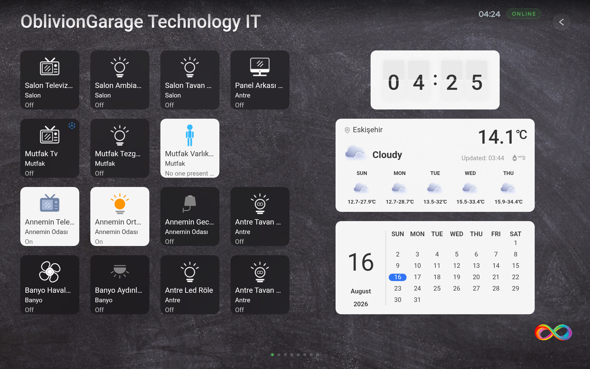
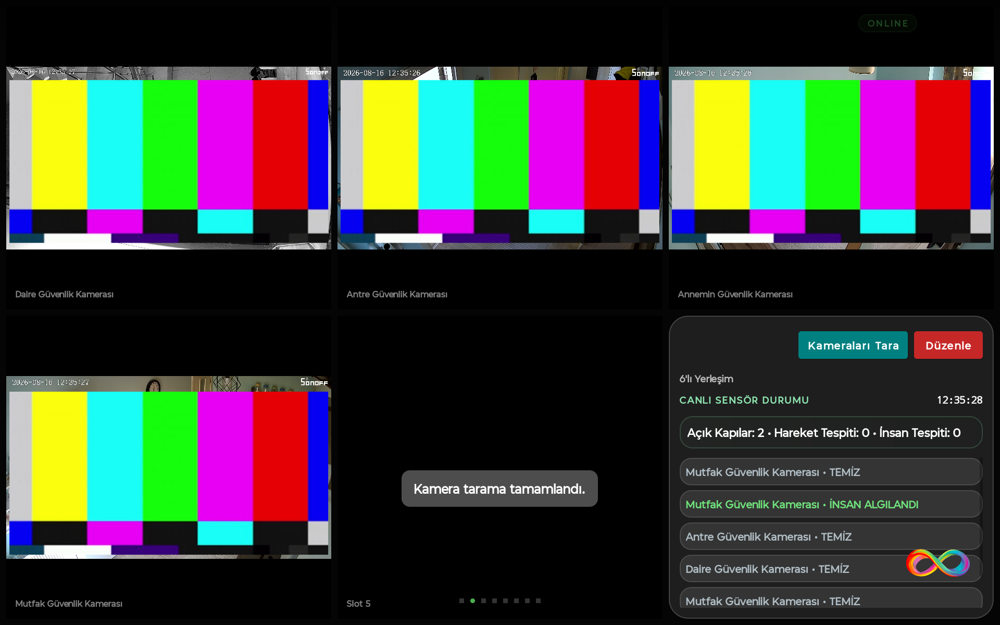
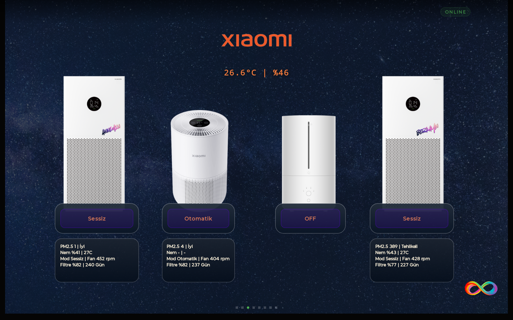
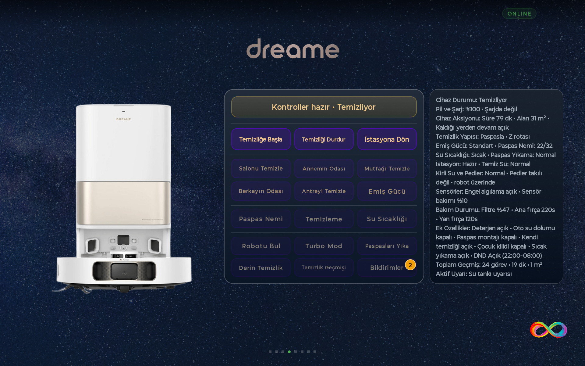
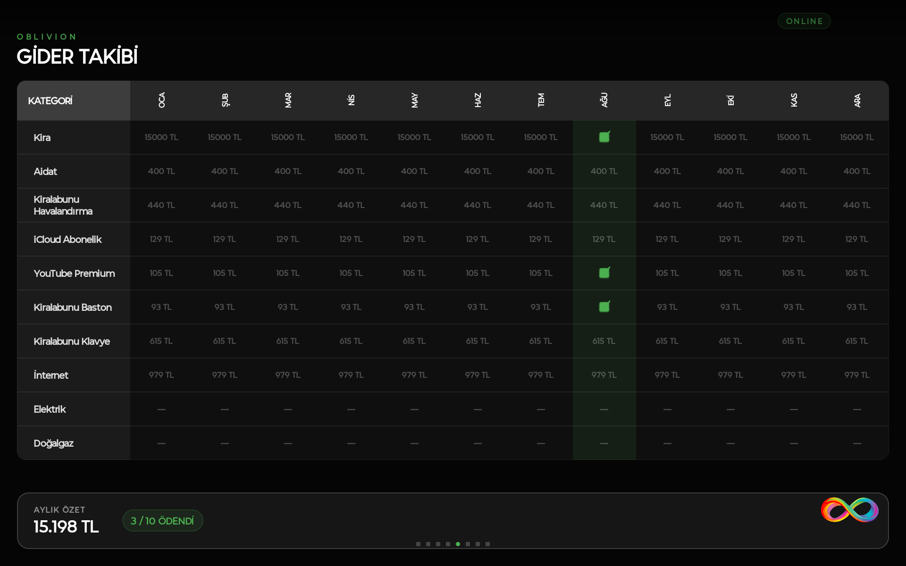
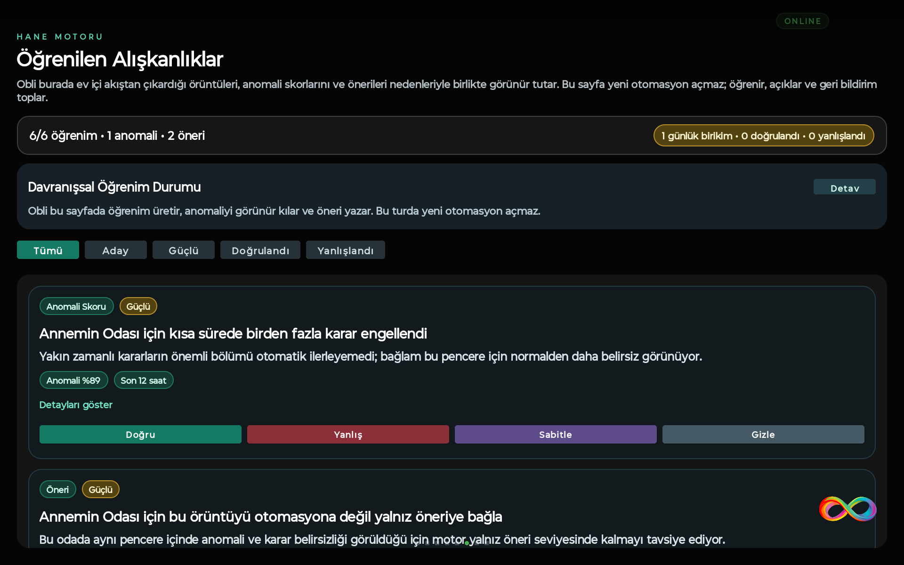
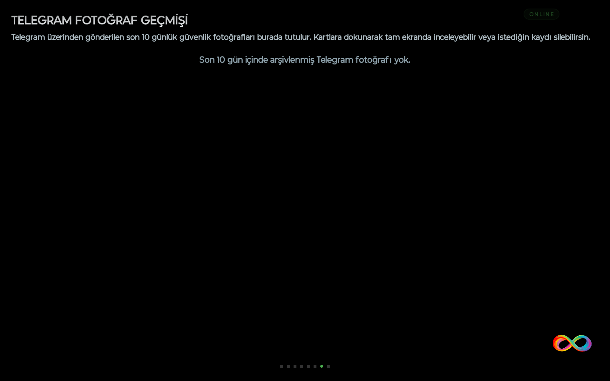
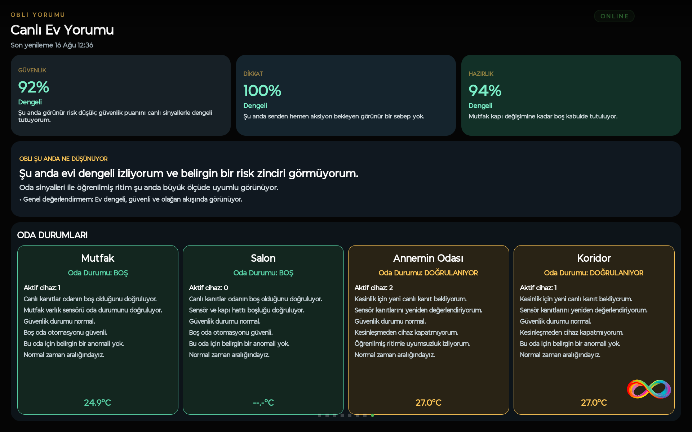
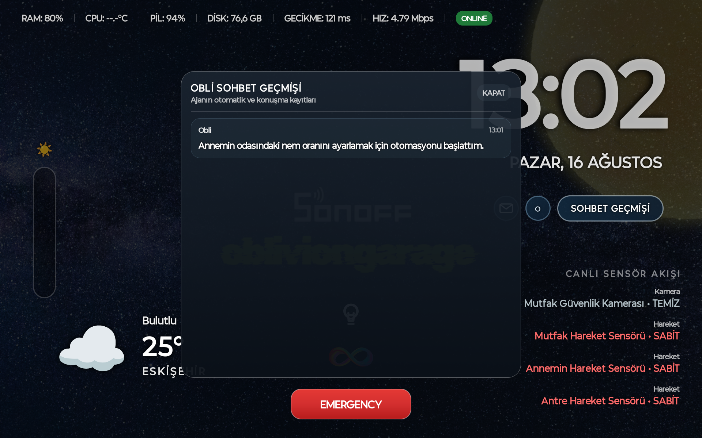

# Visual Showcase

This document is the visual index for the RAZE OS Home showcase. The screenshots are numbered so a prospective buyer can move through the product in a logical order.

## 01 — Home

The persistent home surface and the central kiosk experience.

## 02 — eWeLink

The device/integration surface for the eWeLink ecosystem.

## 03 — Camera

Camera and visual-security functionality.

## 04 — Xiaomi

Xiaomi integration surface.

## 05 — Dreame

Dreame robot-cleaning integration and control surface.

## 06 — Finance

The household finance/tracking surface.

## 07 — Household Learning

The household learning surface, including learned patterns and feedback-driven knowledge.

## 08 — Telegram

Telegram/security communication surface.

## 09 — Autonomous Reasoning

The reasoning surface where contextual autonomous decisions can be exposed to the user.

## 10 — Agent

The agent/system interaction surface.

## 11 — Cover

The primary showcase image used at the top of the repository.

---

## Visual notes for buyers

The screenshots are product captures rather than stock imagery. They are intended to show the breadth of the existing Android kiosk application before private source-code due diligence.

The numbered sequence is deliberately aligned with the product surfaces described throughout the documentation. A screenshot demonstrates the UI surface; detailed claims about underlying behavior are documented separately in `FEATURES.md`, `ARCHITECTURE.md`, `SMART_HOME_INTEGRATIONS.md` and `REAL_WORLD_SCENARIOS.md`.
